# Architecture

## Overview

The system is split into three independently deployable services:

```mermaid
flowchart LR
    subgraph web["web — Next.js (App Router)"]
        W1["UI (chat, auth)"]
        W2["Auth — NextAuth v5"]
        W3["Prisma → Postgres"]
        W4["/api/chat route"]
    end

    subgraph nlp["nlp-service — Python / FastAPI"]
        N1["Intent parsing"]
        N2["Overpass / Places / Foursquare geo-search"]
        N3["Rule-based scoring & card formatting"]
    end

    subgraph ollama["ollama — Local LLM runtime"]
        O1["llama3.2"]
        O2["Called only from the web service"]
    end

    web -- "HTTP query + lat/lon" --> nlp
    nlp -- "structured JSON (cards)" --> web
    web -- "ollama.chat() — structured JSON as a system prompt" --> ollama
    ollama -- "natural-language reply" --> web
```

*(If your Markdown viewer doesn't render Mermaid, see [`docs/assets/architecture-overview.png`](./assets/architecture-overview.png) for a static version — prompt to regenerate it is in the comment below.)*

<!--
Image-generation prompt (e.g. for Gemini / Imagen), used to produce docs/assets/architecture-overview.png:

"A clean, minimal technical architecture diagram for a software system, flat vector style,
dark background, white/light-gray text and outlines, monospace-adjacent sans-serif font.
Three rounded rectangle boxes arranged horizontally, evenly spaced, connected by labeled arrows.

Box 1, left, titled 'web — Next.js (App Router)':
  bullet list inside: 'UI (chat, auth)', 'Auth — NextAuth v5', 'Prisma → Postgres', '/api/chat route'.

Box 2, center, titled 'nlp-service — Python / FastAPI':
  bullet list inside: 'Intent parsing', 'Overpass / Places / Foursquare geo-search', 'Rule-based scoring & card formatting'.

Box 3, right, titled 'ollama — Local LLM runtime':
  bullet list inside: 'llama3.2', 'Called only from the web service'.

Arrows:
  - A solid arrow from Box 1 to Box 2, labeled 'HTTP query + lat/lon'.
  - A solid arrow from Box 2 back to Box 1, labeled 'structured JSON (cards)', drawn as a separate
    parallel line just below/above the first arrow (not overlapping) so both directions are readable.
  - A longer solid arrow from Box 1 down and across to Box 3, labeled 'ollama.chat() — structured JSON as system prompt'.
  - A solid arrow from Box 3 back to Box 1, labeled 'natural-language reply'.

Style: generous padding inside each box, rounded corners (8px radius), thin 1.5px borders,
consistent arrow weight, no drop shadows, no gradients, no 3D effects, no icons or logos,
16:9 aspect ratio, high contrast, crisp enough to be legible at 1200px wide, suitable for
embedding in a GitHub README. Do not include any watermark or extra decorative elements."
-->

- **web** — the Next.js app. Owns the UI, authentication, and persistence. It never talks to Overpass/Google/Foursquare directly; it delegates all of that to the NLP service.
- **nlp-service** — a stateless-ish (in-memory session store) FastAPI app that turns a raw user query + coordinates into structured JSON: an intent, a list of "cards" (candidate places with scores, evidence, links), and metadata like the parsed dish/budget.
- **ollama** — the only generative language model in the pipeline. It receives the structured JSON as context and is asked to phrase a natural reply. It has no tools and does no retrieval itself.

This separation is intentional: **the NLP layer is fully rule-based / templated** (`Phase_2.py`, `nlp_layer.py`, `final.py`) and does not call any LLM. Ollama is the single generative step, invoked from the Next.js `/api/chat` route. This avoids duplicating "AI" work across two layers and keeps the geo-search logic deterministic and debuggable.

## Request flow: a single chat message

1. **Client** (`hooks/useChat.ts`) captures the browser's geolocation on mount via `navigator.geolocation.getCurrentPosition`, and keeps it in React state (`{ lat, lon }`).
2. The user sends a message. The hook:
   - Optimistically appends the user's message to the active conversation in local state.
   - Persists it to `POST /api/messages` if the user is authenticated.
   - Calls `POST /api/chat` with the full message list, `convoId`, `lat`, and `lon`.
3. **`app/api/chat/route.ts`** (Next.js, Node runtime):
   - Extracts the latest user message.
   - Calls the NLP service: `POST {NLP_SERVICE_URL}/query` with `{ query, session_id: convoId, lat, lon }`.
   - If the NLP service is unreachable or errors, it **fails soft**: it builds a fallback `{ intent: "nlp_unavailable", cards: [] }` payload instead of failing the whole request, so Ollama can still respond conversationally.
   - Wraps the structured JSON in a system prompt instructing Ollama to answer naturally and never mention JSON/fields/structured data.
   - Calls `ollama.chat({ model, messages: [systemPrompt, ...messages] })` and returns `{ reply: <text> }`.
4. **nlp-service** (`nlp/api.py`, `POST /query`):
   - Looks up or creates a `GeoFoodSession` keyed by `session_id` (the conversation's `convoId`), so follow-up questions ("show me the second one", "is it open now?") reuse the previous search's results without needing the client to resend context.
   - Runs `session.handle_message_structured(query)` off the event loop thread (`asyncio.to_thread`), since the underlying pipeline does blocking HTTP calls and web scraping.
   - Inside `GeoFoodSession` (`final.py`):
     - `_is_new_search_intent()` heuristically decides whether this is a new search (has a dish/budget, or no prior context) or a follow-up (refers to "the second place", "top 3", "is it open now", etc.).
     - New searches call into `Phase_2.find_places(...)`.
     - Follow-ups reuse `self.last_raw_top_places` / `self.last_places_for_layer` and the tracked `focus_index`.
   - Returns `{ intent, message?, cards: [...] }` — never prose written for the end user; that's Ollama's job.
5. **Response** flows back through `/api/chat` → the client, which appends the assistant's message to the conversation and persists it via `POST /api/messages` if authenticated.

## The geo-search pipeline (`Phase_2.py`)

At a high level, `find_places()` / `find_places_extended()`:

1. Parses the dish and an optional budget out of the free-text query (`parse_dish_from_query`, `parse_budget_from_query`), and expands the dish into related keywords/synonyms.
2. Queries **OpenStreetMap via the Overpass API** for nearby places matching relevant OSM tags, with retries across three public mirrors (`overpass-api.de`, `lz4.overpass-api.de`, `overpass.kumi.systems`).
3. If Overpass returns nothing (or too little), falls back to / supplements with **Google Places** and **Foursquare** search.
4. For each candidate, optionally scrapes the place's website / aggregator pages (Zomato, Swiggy, etc. links, if discoverable) for menu items, price signals, and review text, feeding a lightweight evidence/summarization step.
5. Deduplicates and merges OSM + Google/Foursquare results that clearly refer to the same physical place (by proximity + name similarity).
6. Scores every candidate with a weighted formula (`compute_final_score_for_entry`) combining:

   | Component | Weight | What it measures |
   |---|---|---|
   | Preference / dish match | 0.30 | Text & (optional) semantic similarity between the query and scraped menu/review text, blended with keyword-hit and evidence-based dish-match metrics |
   | Rating | 0.25 | Normalized Google/OSM rating (0–1 scale) |
   | Price fit | 0.20 | How well an estimated price fits the user's stated budget |
   | Distance | 0.15 | Haversine distance from the user, decaying to 0 past ~8 km |
   | Open-now | 0.10 | 1.0 if currently open, 0.0 if closed, 0.5 if unknown |

   Weights are simple constants (`W_PREF`, `W_RATING`, `W_DIST`, `W_TIME`, `W_PRICE`) at the top of `Phase_2.py`, and scores are normalized 0–1 across the result set before being returned.
7. Returns the top-K entries with `score_components` attached, so the reasoning behind a ranking is inspectable.

`nlp_layer.py` then turns the raw ranked entries into "cards" — a per-place structure with reasoning text, evidence snippets, links (including an optional Google Custom Search image lookup), and a Google Maps link — all templated, no LLM involved.

## Geospatial approach

Distances are computed with a plain **Haversine formula** (`haversine_km` in `Phase_2.py`) via straightforward Python math, not PostGIS or a spatial index. This is a deliberate pilot-scale simplification: the dataset is small and scoped to a single city, so an `$queryRaw` Haversine query (or, here, in-process Python calculation) is simpler to run and reason about than standing up PostGIS. If the platform expands beyond one city or to a much larger place count, PostGIS (or a proper spatial index) is the natural next step.

## Authentication architecture

NextAuth v5 is split across two files specifically to respect the Edge Runtime / Node.js boundary:

- **`auth.config.ts`** — providers and callbacks only, no adapter. This is Edge-safe and is what `middleware.ts` imports, because Edge Runtime cannot use Node-only packages.
- **`auth.ts`** — the full configuration, adding `PrismaAdapter(prisma)` and the real `Credentials` provider logic (bcrypt password check against the database). This is imported by Node.js route handlers (`app/api/**/route.ts`, server components) where the Prisma client (which depends on `pg`/`ws`, Node-only) is safe to use.

Sessions use the **JWT strategy** (`session: { strategy: "jwt" }`) specifically so `middleware.ts` can authorize requests without a database round-trip at the edge.

See [`docs/DATABASE.md`](./DATABASE.md) and [`docs/API_REFERENCE.md`](./API_REFERENCE.md#auth) for the concrete auth endpoints and schema.

## Persistence & offline-first chat

Chat state is designed to work whether or not the user is signed in:

- **Signed out / no session yet**: conversations live in `localStorage` under the key `chat_conversations`, managed entirely client-side by `useChat.ts`.
- **Signed in**: conversations and messages are created and read from Postgres via `/api/conversations` and `/api/messages`. `useChat.ts` still writes every conversation list update to `localStorage` as a redundant offline fallback.
- **On sign-in**: `AuthSyncListener` (mounted globally, renders nothing) fires `syncLocalStorageToNeon(userId)`, which POSTs any local conversations to `/api/migrate-localStorage`. That route is idempotent — it matches on client-generated IDs (`convo.id`, `msg.id`) so re-running the migration (e.g. on every login) doesn't duplicate rows.

## Known limitations & roadmap

- **Overpass reliability**: public Overpass mirrors rate-limit and occasionally time out, which surfaces as repeated warning logs (the retry loop attempts each of 3 mirrors). This is not a missing API key — it's the nature of free, shared OSM infrastructure. Longer-term options: self-host an Overpass instance, cache query results locally, or lean more on the Google Places fallback.
- **Single-city, manually seeded pilot scope**: there's no automated ingestion pipeline for new shop data yet; PostGIS was deliberately skipped in favor of Haversine at this scale.
- **LLM API key**: the NLP microservice's Google Places / Custom Search integration currently depends on developer-provided API keys. A production LLM API key (separate from Ollama) is expected to be provisioned centrally in a future iteration.
- **Prisma driver adapter**: confirm `previewFeatures = ["driverAdapters"]` is present in `schema.prisma`'s `generator` block and that `npx prisma generate` has been re-run after any schema change — without this, the adapter is silently ignored.
- **`next.config.ts` sets `typescript.ignoreBuildErrors: true`**: this was added as a temporary unblock during development and should be revisited before a production release, since it will let real type errors ship silently.